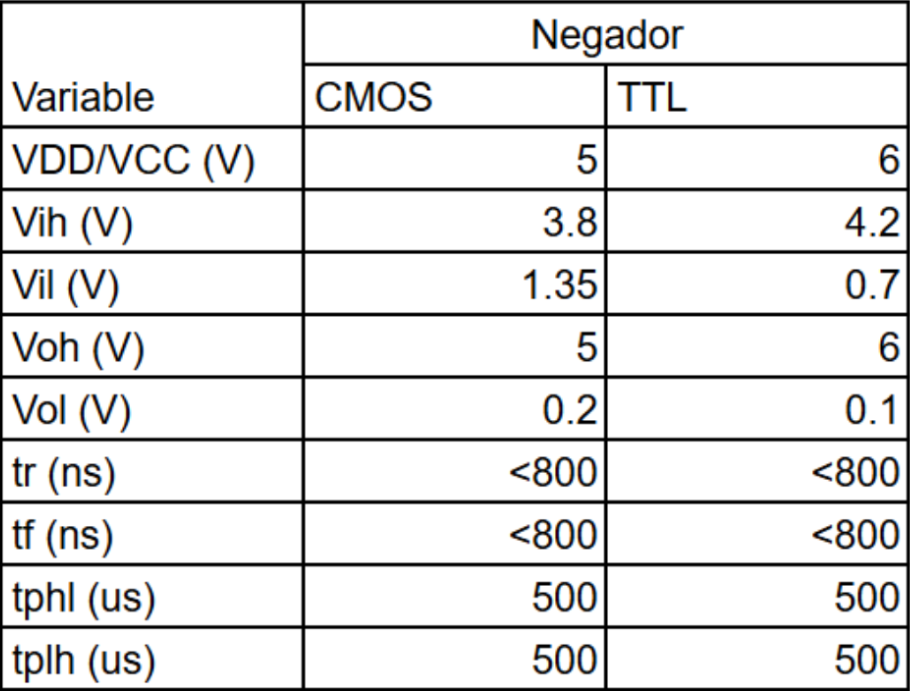

# Laboratorio-Digital-1

Laboratorio 1. Comparación de tecnología CMOS y TTL.

Parte 1

A partir de los datasheet, se pudieron comparar las características de cada tecnología. En cuanto a pines de entrada, salida y polarización, son prácticamente iguales, ambos cuentan con seis negadores dispuestos a lo largo del encapsulado, solo cambia el nombre de cada uno de ellos. Otra cosa a resaltar, es que la tensión de polarización para el TTL tiene un rango operativo de 2VCC6, mientras que la del CMOS tiene un rango de 3VDD18.

Tabla 1. Voltajes de salida y entrada, tiempo de subida (tr) y bajada (tf),  tiempo de paso de nivel alto a bajo (tphl) y tiempo de paso de nivel bajo a alto (tplh) de un CMOS y TTL.

En la Tabla 1, se evidencian los parámetros encontrados experimentalmente para el CMOS y TTL para la tensión de polarización indicada en la tabla. Estos parámetros, en general, coinciden con los suministrados por los fabricantes en su respectivo datasheet. Los únicos que no coincidieron fueron el Vil para el TTL y el Vol para el CMOS.

Parte 2. 

Por otro lado, se determinó el FAN-OUT de cada dispositivo midiendo el decaimiento a la salida de Voh y Vol, respecto a la señal de entrada, cuando se conectan tres negadores. Como no fue posible conectar negadores hasta que se viera la variación real de la tensión por la limitación en el número de dispositivos que podíamos conseguir, se hizo la observación con solo tres en ambos casos.
En el caso del CMOS, el Voh decae de 5 a 4.9 V y el Vol aumenta de 0.2 a 0.3 V, como se muestra en la Figura 1 y 2. Teniendo en cuenta que el Voh mínimo para una polarización de 5V es 4.95, encontramos que el dispositivo se encuentra al borde de dejar de operar correctamente con estas tres entradas a la salida. Asimismo, para el Vol tenemos una tensión máxima de 0.05 V, por lo que el dispositivo deja de tener en orden sus valores operativos.

Figura 1. Voh del negador TTL cuando tiene conectadas tres entradas negadoras a la salida.

Figura 2. Vol del negador TTL cuando tiene conectadas tres entradas negadoras a la salida.

