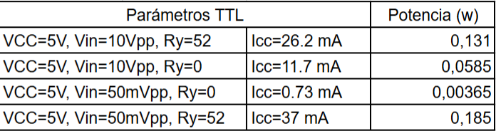

# Laboratorio-Digital-1

Laboratorio 1. Comparación de tecnología CMOS y TTL.

Parte 1

A partir de los datasheet, se pudieron comparar las características de cada tecnología. En cuanto a pines de entrada, salida y polarización, son prácticamente iguales, ambos cuentan con seis negadores dispuestos a lo largo del encapsulado, solo cambia el nombre de cada uno de ellos. Otra cosa a resaltar, es que la tensión de polarización para el TTL tiene un rango operativo de 2VCC6, mientras que la del CMOS tiene un rango de 3VDD18.

Tabla 1. Voltajes de salida y entrada, tiempo de subida (tr) y bajada (tf),  tiempo de paso de nivel alto a bajo (tphl) y tiempo de paso de nivel bajo a alto (tplh) de un CMOS y TTL.

En la Tabla 1, se evidencian los parámetros encontrados experimentalmente para el CMOS y TTL para la tensión de polarización indicada en la tabla. Estos parámetros, en general, coinciden con los suministrados por los fabricantes en su respectivo datasheet. Los únicos que no coincidieron fueron el Vil para el TTL y el Vol para el CMOS.

Parte 2. 

Por otro lado, se determinó el FAN-OUT de cada dispositivo midiendo el decaimiento a la salida de Voh y Vol, respecto a la señal de entrada, cuando se conectan tres negadores. Como no fue posible conectar negadores hasta que se viera la variación real de la tensión por la limitación en el número de dispositivos que podíamos conseguir, se hizo la observación con solo tres en ambos casos.
En el caso del CMOS, el Voh decae de 5 a 4.9 V y el Vol aumenta de 0.2 a 0.3 V, como se muestra en la Figura 1 y 2. Teniendo en cuenta que el Voh mínimo para una polarización de 5V es 4.95, encontramos que el dispositivo se encuentra al borde de dejar de operar correctamente con estas tres entradas a la salida. Asimismo, para el Vol tenemos una tensión máxima de 0.05 V, por lo que el dispositivo deja de tener en orden sus valores operativos.

   

Figura 1. Voh del negador TTL cuando tiene conectadas tres entradas negadoras a la salida.

    

Figura 2. Vol del negador TTL cuando tiene conectadas tres entradas negadoras a la salida.

Para el caso del TTL, el Voh decae de 6 a 5.9 V y el Vol aumenta de 0.1 a 0.2 V, como se muestra en la Figura 3 y 4. Para este dispositivo, el Voh mínimo es de 5.9 V, por lo que el dispositivo también estaría al borde de no cumplir con sus valores nominales. De forma similar, el Vol máximo indicado por los fabricantes es 0.1 V, por lo que también estaría muy cerca de no cumplir con sus valores nominales.

Figura 3. Voh del negador CMOS cuando tiene conectadas tres entradas negadoras a la salida.

Figura 4. Vol del negador CMOS cuando tiene conectadas tres entradas negadoras a la salida.

Por otro lado, en la Figura 5 y 6 se presentan la potencia disipada por cada negador cuando la resistencia es 0  y cuando hay una resistencia de 52  entre la entrada y la salida. Como se puede evidenciar al comparar las dos figuras, el negador TTL tiene mayor disipación de potencia respecto al negador CMOS en todos los casos.

Figura 5.  Disipación de potencia para el dispositivo TTL.

        
Figura 6. Disipación de potencia para el dispositivo CMOS.

Adicionalmente, se montó el circuito de la Figura 7, para evidenciar el funcionamiento de cada tecnología. La finalidad de dicho circuito, era mostrar el diodo encendido o apagado según correspondiera el caso. Cuando la entrada tuviera un nivel lógico alto (1), la salida iba a tener uno bajo (0), por lo que el LED no se iba a encender. En caso contrario, cuando la entrada presentaraq un nivel lógico bajo, la salida iba a arrojar uno alto, haciendo que el LED encendiera.

Figura 7. Circuito propuesto para evidenciar el comportamiento de los dos dispositivos.

Parte 3.

Finalmente, se montaron dos osciladores en anillo, uno con el negador CMOS y otro con el negador TTL, como se evidencia en la Figura 8 y 9. Adicionalmente, se realizaron mediciones de tensión en el osciloscopio con el fin de observar el comportamiento de cada uno de estos osciladores. Estas se evidencian en la Figura 10 y 11.

Figura 8. Oscilador en anillo con el negador CMOS.

Figura 9. Oscilador en anillo con el negador TTL.

En la Figura 10, se puede observar cómo el comportamiento de la señal obtenida a la salida del oscilador CMOS es parecida a una triangular y su frecuencia de oscilación (3.08 MHz). Por su parte, el comportamiento de la señal de salida del oscilador TTL se muestra en la Figura 11. En esta figura se ve que la señal tiene una forma similar a la carga y descarga de un condensador, por lo que se sospecha de la presencia de un condensador a la salida del negador. Su frecuencia de oscilación es 3.22 MHz, la cual es mayor que la presentada en el oscilador TTL. 

Figura 10. Señal obtenida a partir del oscilador realizador con los negadores CMOS.

Figura 11. Señal obtenida a partir del oscilador realizador con los negadores TTL. 

